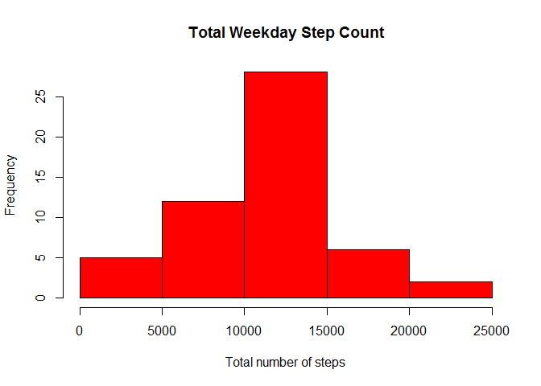
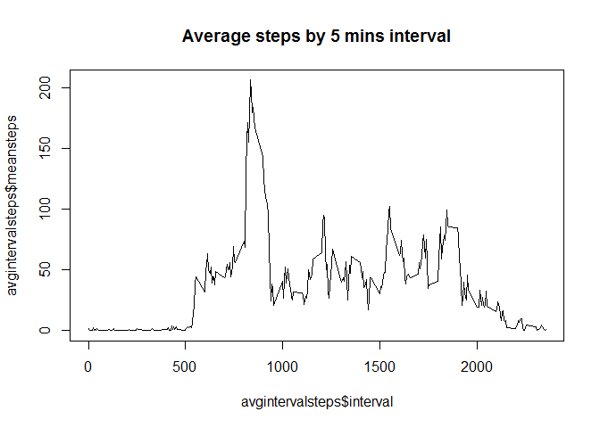
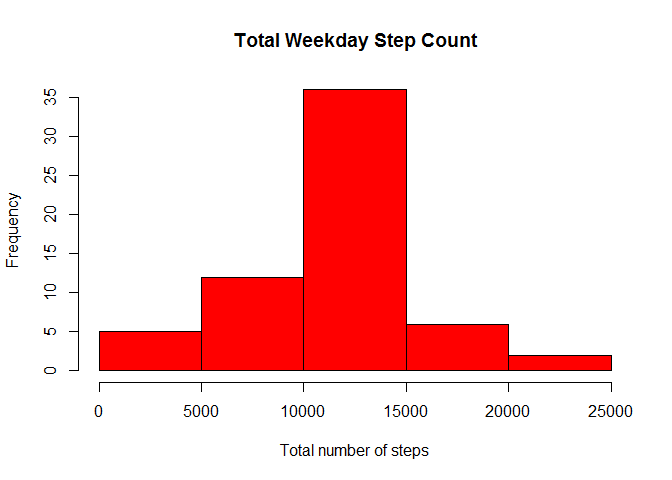
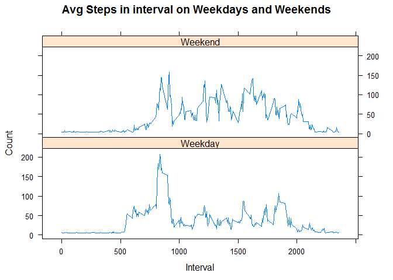

# Reproducible Research: Peer Assessment 1


This is a R Markdown Document
Load CSV file


```r
df <- read.csv("activity.csv", sep = ",", header = TRUE)

str(df)
```

```
## 'data.frame':	17568 obs. of  3 variables:
##  $ steps   : int  NA NA NA NA NA NA NA NA NA NA ...
##  $ date    : Factor w/ 61 levels "2012-10-01","2012-10-02",..: 1 1 1 1 1 1 1 1 1 1 ...
##  $ interval: int  0 5 10 15 20 25 30 35 40 45 ...
```

Total number of steps using sum function and groupy by the date

```r
library(dplyr)
```

```
## Warning: package 'dplyr' was built under R version 3.2.5
```

```
## 
## Attaching package: 'dplyr'
```

```
## The following objects are masked from 'package:stats':
## 
##     filter, lag
```

```
## The following objects are masked from 'package:base':
## 
##     intersect, setdiff, setequal, union
```


```r
stepcounts <- df %>% group_by(date) %>% summarize(Totsteps =sum(steps))
```

plot histogram

```r
hist(stepcounts$Totsteps, xlab = "Total number of steps", ylab = "Frequency", col = "red", main = "Total Weekday Step Count")
```

<!-- -->

Mean and median number of steps taken each day
Follwing is the Mean

```r
mean(stepcounts$Totsteps, na.rm = TRUE)
```

```
## [1] 10766.19
```

Follwoing is the median

```r
median(stepcounts$Totsteps, na.rm = TRUE)
```

```
## [1] 10765
```

Time series plot for avg daily activity pattern

First find steps for each 5-minute interval by totaling the steps and group by "interval"


```r
avgintervalsteps <- df %>% group_by(interval) %>% summarize(meansteps = mean(steps, na.rm = TRUE))
```

Plot the line graph using the average found in the step above


```r
plot(avgintervalsteps$interval, avgintervalsteps$meansteps, type = "l", main = "Average steps by 5 mins interval")
```

<!-- -->

Which 5-minute interval, on average across all the days in the dataset, contains the maximum number of steps?

```r
maxavgnumsteps <- avgintervalsteps$interval[which.max(avgintervalsteps$meansteps)]
table(maxavgnumsteps)
```

```
## maxavgnumsteps
## 835 
##   1
```

Imputing Missing values
calculate and report the total number of missing values in the dataset

```r
sum(is.na(df$steps))
```

```
## [1] 2304
```

Devise a strategy for filling in all of the missing values in the dataset

First create a data frame that is equal to the original data frame


```r
newdf <- df
```

Now reaplce NA values with the mean values of the steps from the original dataframe.


```r
newdf$steps[is.na(newdf$steps)] <- mean(df$steps, na.rm = TRUE)
```

Check if NA's are present in the new dataset

```r
colSums(is.na(newdf))
```

```
##    steps     date interval 
##        0        0        0
```

Plot a histogram

first, get the  total step count


```r
stepcounts1 <- newdf %>% group_by(date) %>% summarize(Totsteps =sum(steps))
```

Plot histogram


```r
hist(stepcounts1$Totsteps, xlab = "Total number of steps", ylab = "Frequency", col = "red", main = "Total Weekday Step Count")
```

<!-- -->

mean and median for total number of steps taken per day

mean

```r
mean(stepcounts1$Totsteps, na.rm = TRUE)
```

```
## [1] 10766.19
```

Meadian

```r
median(stepcounts1$Totsteps, na.rm = TRUE)
```

```
## [1] 10766.19
```

Are there differences in activity patterns between weekdays and weekends
Given date is a weekday or weekend


```r
newdf$weekday <- weekdays(as.Date(newdf$date))
```


```r
newdf$typeofday <- "Weekday"
```


```r
newdf$typeofday[newdf$weekday %in% c("Saturday", "Sunday")] <- "Weekend"
```

Make a panel plot containing time series plot of the 5-miute interval in x axis and avg number of steps taken, avg across all week day and weekend in y axis

First, calculate avg steps


```r
avgintervalstepsweek <- newdf %>% group_by(interval, typeofday) %>% summarize(meansteps = mean(steps))
```


```r
library(latticeExtra)
```

```
## Warning: package 'latticeExtra' was built under R version 3.2.5
```

```
## Loading required package: lattice
```

```
## Warning: package 'lattice' was built under R version 3.2.5
```

```
## Loading required package: RColorBrewer
```

```
## Warning: package 'RColorBrewer' was built under R version 3.2.3
```

```r
xyplot(meansteps ~ interval | typeofday, data = avgintervalstepsweek, type = "l", main = "Avg Steps in interval on Weekdays and Weekends", 
        xlab = "Interval", ylab = "Count", layout = c(1,2))
```

<!-- -->

